# BrowserBox End-to-End Testing

Two complementary approaches for testing BrowserBox Python scripts in the Pyodide environment:

## 🔧 Individual Script Testing (`individual/`)

**Purpose**: Debug and test single Python scripts quickly  
**Best for**: Development, unit testing, quick validation  
**Environment**: Isolated Pyodide instance with same packages as main app  
**Tools**: HTML test runner + Python CLI tool  

```bash
# Test a single script with data files
python e2e/individual/test-pyodide-script.py \
    --script=my_script.py \
    --data=file1.csv,file2.parquet
```

[📖 **Individual Testing Guide** →](individual/README.md)

## 🚀 Workflow Automation (`workflow/`)  

**Purpose**: Complete configuration → execution → results workflows  
**Best for**: Integration testing, continuous development, CI/CD pipelines  
**Environment**: Full BrowserBox UI with real user interactions  
**Tools**: Python Playwright automation suite  

```bash
# Run complete automation workflow
python e2e/workflow/workflow_automation.py \
    --config config.zip \
    --output ./results
```

[📖 **Workflow Automation Guide** →](workflow/README.md)

## 🤔 When to Use Which?

| Use Case | Individual | Workflow | Why |
|----------|------------|----------|-----|
| **🐛 Script Debugging** | ✅ **Primary** | ➖ | Fast, focused, no UI overhead |
| **🧪 Unit Testing** | ✅ **Primary** | ➖ | Isolated environment, quick feedback |
| **🔄 Development Loop** | ✅ First | ✅ **Then** | Debug → validate → integrate |
| **📦 Configuration Testing** | ➖ | ✅ **Primary** | Full ZIP package workflows |
| **🔗 Integration Testing** | ➖ | ✅ **Primary** | End-to-end user workflows |
| **🤖 CI/CD Pipelines** | ✅ Unit tests | ✅ **Integration tests** | Both have their place |
| **📊 Result Collection** | Basic files | ✅ **Full automation** | Download, analysis, reports |

## 🚀 Quick Start

### Prerequisites

Both approaches require:
```bash
pip install playwright
playwright install chromium
```

### Individual Testing (Fast Setup)
```bash
# Test a single script
cd e2e/individual
python test-pyodide-script.py --script=../../path/to/script.py
```

### Workflow Automation (Complete Setup)
```bash
# Install dependencies
pip install -r e2e/workflow/requirements.txt

# Run full workflow
python e2e/workflow/workflow_automation.py --config config.zip --output ./results
```

## 📊 Feature Comparison

| Feature | Individual | Workflow |
|---------|------------|----------|
| **Environment** | Isolated Pyodide | Full BrowserBox UI |
| **Configuration** | Manual file loading | ZIP package automation |
| **Script Execution** | Single script | Multi-script orchestration |
| **Result Handling** | Basic file output | Advanced download/collection |
| **Error Handling** | Script-level | Workflow-level + UI integration |
| **Performance** | ⚡ Fast | 🔄 Comprehensive |
| **Setup Complexity** | 🟢 Simple | 🟡 Moderate |
| **Debugging** | ✅ Excellent | 🔍 Full context |

## 🔄 Recommended Development Workflow

```mermaid
graph TD
    A[Write Python Script] --> B[Individual Testing]
    B --> C{Script Works?}
    C -->|No| A
    C -->|Yes| D[Add to Config Package]
    D --> E[Workflow Testing]
    E --> F{Integration OK?}
    F -->|No| A
    F -->|Yes| G[Deploy/CI]
    G --> H[Continuous Monitoring]
    H --> I{Issues Found?}
    I -->|Yes| A
    I -->|No| J[✅ Success!]
```



### Step-by-Step Process

1. **🔨 Development Phase**: Use `individual/` for rapid script development and debugging
2. **📦 Integration Phase**: Package scripts into configuration ZIP files
3. **🧪 Validation Phase**: Use `workflow/` to test complete user workflows
4. **🚀 Deployment Phase**: Run both approaches in CI/CD pipelines
5. **📊 Monitoring Phase**: Use workflow automation for continuous validation

## 🎯 Example Scenarios

### Scenario 1: Developing a Data Analysis Script
```bash
# 1. Debug individual script
cd e2e/individual
python test-pyodide-script.py --script=analyze_sales.py --data=sales.csv

# 2. Add to configuration and test workflow
python ../workflow/workflow_automation.py --config sales_analysis.zip --output ./results
```

### Scenario 2: CI/CD Pipeline
```yaml
# .github/workflows/test-scripts.yml
- name: Unit tests (individual scripts)
  run: |
    for script in scripts/*.py; do
      python e2e/individual/test-pyodide-script.py --script="$script"
    done

- name: Integration tests (workflow)
  run: pytest e2e/workflow/test_automation.py -v
```

### Scenario 3: Configuration Package Validation
```bash
# Test all configurations in a directory
for config in configs/*.zip; do
    python e2e/workflow/workflow_automation.py --config "$config" --output "results/$(basename "$config" .zip)"
done
```

## 🔧 Advanced Usage

### Custom Test Configurations

**Individual Testing**:
```python
# Custom validation in individual testing
import subprocess
import sys

result = subprocess.run([
    sys.executable, 'e2e/individual/test-pyodide-script.py',
    '--script=my_script.py',
    '--data=test_data.csv'
], capture_output=True, text=True)

assert result.returncode == 0, f"Script failed: {result.stderr}"
```

**Workflow Automation**:
```python
# Custom workflow with validation
from e2e.workflow.browserbox_automation import BrowserBoxAutomation

async def custom_validation():
    async with BrowserBoxAutomation() as automation:
        await automation.load_configuration("config.zip")
        results = await automation.execute_all_scripts()
        
        # Custom assertions
        csv_results = [r for r in await automation.get_all_results() 
                      if r.filename.endswith('.csv')]
        assert len(csv_results) >= 3, "Expected at least 3 CSV outputs"
```

## 📚 Documentation Structure

- **[`e2e/README.md`](README.md)** - This overview document
- **[`individual/README.md`](individual/README.md)** - Individual script testing guide
- **[`workflow/README.md`](workflow/README.md)** - Workflow automation guide
- **`individual/pyodide-test-runner.html`** - Standalone HTML test runner
- **`individual/test-pyodide-script.py`** - CLI tool for individual testing
- **`workflow/browserbox_automation.py`** - Python automation class
- **`workflow/workflow_automation.py`** - Complete workflow CLI tool
- **`workflow/test_automation.py`** - Comprehensive test suite

## 🚨 Troubleshooting

### Common Issues

**BrowserBox not running**: 
```bash
npm run dev  # Should start on http://localhost:5173
```

**Import errors**:
```bash
# Run from project root
cd /path/to/BrowserBoxV5
python e2e/workflow/workflow_automation.py --help
```

**Permission issues**:
```bash
# Ensure download directories exist
mkdir -p results/downloads
chmod 755 results/downloads
```

## 🎯 Summary

- **🔧 Individual testing** = Fast, focused, great for development
- **🚀 Workflow automation** = Comprehensive, integrated, great for validation
- **🤝 Use both together** = Complete testing coverage
- **📈 Start simple, scale up** = Individual → workflow → CI/CD

Choose the right tool for the right job, and leverage both approaches for a robust testing strategy!

---

**Quick Links**: [Individual Testing](individual/) | [Workflow Automation](workflow/) | [Project Root](../)